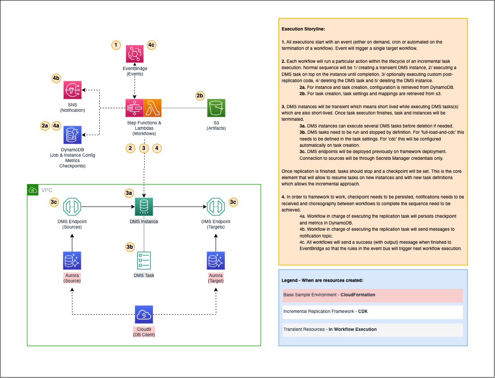

# Welcome to Incremental Replication Framework for Amazon Database Migration Service (DMS)

## What is Incremental Replication Framework for Amazon DMS?

This solution aims to introduce a framework to solve some common issues that are found when designing data replication strategies with Amazon DMS:

- Not all data integration workloads require near-real-time data replication. But can definitely benefit from CDC feature since no ETL code is required to be developed and managed on integration layer but afterwards.
- Costs for DMS ongoing resources can add-up (even more when HA is introduced). Having an incremental replication on top of transient instances when near-real-time replication is not required can be a great option when cost-optimizing some workloads.

## Some basic concepts used along the way

Before you get started it is important to understand some basic concepts which are aligned to how DMS works:
- Job and DMS replication task are used interchangeably in this framework. Remember that replication tasks are expected to be of incremental nature. This means that they should stop at some point and a checkpoint needs to be generated. This allows the framework to resume the task on top of new resources eliminating the dependency of an ongoing instance.

    'full-load-and-cdc' tasks should stop after full load completion (this is set up in the setting file of the task) and that 'cdc' tasks will be created with a cdc stop point always. **Ongoing tasks are not expected nor supported**. All tasks will generate a checkpoint that will be persisted in DynamoDB so that task and instances can be deleted and resumed at some point in the future without loosing track of the replication itself.

- A Workflow refers to a state machine. Since the implementation of the framework is following a decoupled event-driven architecture, different purpose-specific workflows were created to allow for complex patterns when triggering each of them on a job execution (please refer to **./assets/images** folder to see a representation of each of them). Available workflows are:

    1. A workflow for creating a DMS replication instance and wait till it is available for use.
    2. A workflow to execute a DMS replication task. This means, that creates the task, starts it and waits till successful termination. Once finished persists checkpoint and task metrics and notifies successful completion.
    3. A workflow to delete a DMS replication task, which waits till successful deletion.
    4. A workflow to delete a DMS replication instance, which waits till successful deletion.
    5. A workflow that is complementary for scenarios when Aurora Postgres is used as source. Workflow will add custom logic to duplicate replication slot on source after a 'full-load-and-cdc' task so that checkpoint tracking is not lost within the database as slot created by DMS task will be deleted on task deletion.

- A Job Flow is a Workflow sequence. As you can imagine, when executing a job, you will probably need to execute a set of the workflows described above (if not all) in a sequence manner. Such choreography is done through EventBridge rules and targets. This is also the reason why at the end of every workflow a final step is included where a completion event is sent to EventBridge so that subsequent workflows are executed. Event messages sent to the event bus include a standard structure containing the output of the workflow.

## How it works?

The solution consists of a CDK project that can be deployed and reused in any AWS environment where underlying services are supported. The following diagram illustrates on a high level how the framework works.



## What is inside this repository?

As you dive in into the repo structure you'll find that it consists of:
- a 'base_environment' folder with a CloudFormation sample environment consisting of a sample VPC, sample source and target Aurora databases and a Cloud9 instance from where you can connect to sample databases. This folder is just for getting started purposes so that you can easily deploy an environment and test the framework so that you better understand its contents.
- a 'src' folder where you will find:
    - a 'code' folder with all of the functional code. Including code for lambda functions, state machines definitions and dms tasks settings and mappings definitions. Note that for the latter, you'll find some examples that will work with 'Getting started' module.
    - a 'constructs' folder with all CDK constructs that were defined for the framework.
    - a 'stacks' folder with all CDK stacks that group resources for deployment.
- a 'config' folder where you can easily configure the framework for it to work properly with you particular environment structure. Each file will contain one or a few exportable dictionaries where you can specify values for your particular environment so that they are correctly mapped on resource deployment. Note that each config file will include documentation and two examples aligned with the 'Getting Started' module.

## How to get started?

The following steps assume that you have your AWS CLI installed and configured with your target AWS environment as the default setup. 

Additionally it assumes that you have CDK 2.81.0. First, create a python virtual environment from within the root of this repository. To create the virtualenv it assumes that there is a `python3` executable in your path with access to the `venv` package.

To manually create a virtualenv on MacOS and Linux:

```
$ python3 -m venv .venv
```

After the init process completes and the virtualenv is created, you can use the following step to activate your virtualenv.

```
$ source .venv/bin/activate
```

Once the virtualenv is activated, you can install the required dependencies.

```
$ pip install -r requirements.txt
```

This repository includes a base sample environment that can be deployed. Once the environment is in place, the framework can be easily configured to work with such sample environment.

### 1 - Deploy the base sample environment

Once repository is setup locally.

- Open the *incremental-replication-framework-for-amazon-dms/base_environment/master_params.json* file. Note that the contents by default are as bellow:

    ``` json
    [
        {
            "ParameterKey": "SourceAuroraEngine",
            "ParameterValue": "postgres"
        },
        {
            "ParameterKey": "TargetAuroraEngine",
            "ParameterValue": "mysql"
        }
    ]
    ```

    This will deploy a sample VPC with two private and two public subnets and corresponding networking setup for communication between subnets. It will also deploy a Cloud9 instance inside the VPC (which is going to be the recommended channel to connect to source and target databases). Finally it will deploy two empty aurora databases (source and target). 

    Note that multiple configurations can be supported for different test scenarios. You could deploy an aurora postgres source and an aurora mysql target, or vice versa or even homogeneous deployments. Just change the values on this file accordingly. 

    Note that only aurora options are available in this sample environment.

- Standing in the root directory *'incremental-replication-framework-for-amazon-dms'* execute the command:

    ``` sh
    sh base_environment/deploy.sh 
    ```

    This command will 1/ create a temporary s3 bucket for packaging CloudFormation templates, 2/ package the CloudFormation template and 3/ deploy it using default AWS CLI profile. When finished will 3/ empty and delete the temporary bucket that was created.

    Please don't interrupt script execution. If it gets interrupted because of any reason, don't forget to clean resources left behind (s3 temporary bucket), since every new execution of the script will create a new bucket.

    Deployment can take up to 30 minutes. You can check progress in the CloudFormation console.

- Review outputs of all sub-stacks. The following outputs will be used when deploying the framework:

    **replication-base-environment-VPCStack**:
    - VPCID: ID of the vpc that was created
    - PrivateSubnet1AID: Id of the first private subnet created
    - PrivateSubnet2AID: Id of the second private subnet created
    - GeneralSecurityGroupID: Id of a general purpose security group with network access to both databases.

    **replication-base-environment-Aurora\<Engine\>SourceStack** and **replication-base-environment-Aurora\<Engine\>TargetStack**:
    - AuroraCredentialsSecret: Note that the completw arn is referenced here. We need only the last element which we will refer to as the \<SECRET-ARN-NAME\>. With this in mind, ARN structure should be **arn:aws:secretsmanager:\<REGION\>:\<ACCOUNT\>:secret:\<SECRET-ARN-NAME\>**
    - RDSEndPointAddress: Writer endpoint path. We will use this when connecting to the database from Cloud9 Only.
    - DBMasterPassword: Database password. This one is fixed for example purposes. We will use this when connecting to the database from Cloud9 Only.

### 2 - Deploy the framework

Once your base environment is up and running

- Open the *incremental-replication-framework-for-amazon-dms/config/common_config.py* file. This is one of the multiple configuration files that will allow you to configure the framework before deploying. As its name suggest, in this file you will configure common resources like vpc properties. 

    Update value for ```ACCOUNT_NUMBER``` with your account number:

    ``` python
    ACCOUNT_NUMBER = '<YOUR-ACCOUNT-NUMBER>'
    ```
    
    Update values of ```VPC_PROPS``` with the output values of vpc sub-stack deployed in previous step:

    ``` python
    VPC_PROPS = {
        'vpc_id': '<YOUR-VPC-ID>', # Include vpc id
        'region': '<YOUR-VPC-REGION>', # Include vpc region
        'availability_zones': ['<YOUR-VPC-AZ1>', '<YOUR-VPC-AZ2>'], # Include vpc azs
        'private_subnets': ['<YOUR-VPC-PRIVATE-SUBNET1-ID>', '<YOUR-VPC-PRIVATE-SUBNET2-ID>'], # Include private subnet ids
        'security_groups': {
            'security_group_01': '<YOUR-VPC-GENERAL-SECURITY-GROUP-ID>' # Include security group id
        }
    }
    ``` 

    Update values of ```COMMON_PROPS```. In particular the ```'notification_emails'``` field. Also, if you have no **dms-cloudwatch-logs-role** nor **dms-vpc-logs-role** in your account already set, use the ```'dms_cloudwatch_logs_role'``` and ```'dms_vpc_role'``` fields to create them on deployment.

    ``` python
    COMMON_PROPS = {
        'notifications_topic_name': 'increp-notifications_topic',
        'notification_emails': [
            '<YOUR-VPC-PRIVATE-SUBNET1-ID>' # Include notification emails
        ],
        'artifact_bucket_name': f"increp-{ACCOUNT_NUMBER}-{VPC_PROPS['region']}-artifact",
        'replication_jobs_config_prefix': 'increp-jobs-config',
        'replication_checkpoints_table_name': 'increp-checkpoints',
        'replication_metrics_table_name': 'increp-metrics',
        'replication_jobs_table_name': 'increp-jobs',
        'replication_instances_table_name': 'increp-instances',
        'replication_event_bus_name': 'increp-event-bus',
        'dms_cloudwatch_logs_role': True, # Only leave as true if no dms-cloudwatch-logs-role role in your account
        'dms_vpc_role': True, # Only leave as true if no dms-vpc-logs-role role in your account
        'dms_secrets_common_role_name': 'increp-dms-secrets-common-role',
        'lambda_replication_common_role_name': 'increp-lambda-common-role',
        'workflow_replication_common_role_name': 'increp-workflow-common-role',
        'eventbridge_replication_common_role_name': 'increp-eventbridge-common-role'
    }
    ``` 

- Open the *incremental-replication-framework-for-amazon-dms/config/endpoints_config.py* file. In this configuration file you will configure DMS endpoints based on your data sources and targets. 

    Note that the main variable to be exported in this file is ```ENDPOINTS_CONFIG``` found at the end of the script. Also note that there are two examples already in place to easily configure the framework for the base environment that was deployed in the previous step. 
    
    Assuming that we are going to deploy the AUrora Postgres (source) to Aurora Mysql (target) scenario, lets update the values of ```POSTGRES_TO_MYSQL_ENDPOINTS_CONFIG``` with the output values of source and target sub-stacks deployed in previous step:

    ``` python
    POSTGRES_TO_MYSQL_ENDPOINTS_CONFIG = {
        'source_endpoint_01': {
            'endpoint': {
                'id': 'aurora-postgres-source-01-full',
                'type': 'source',
                'engine': 'aurora-postgresql',
                'db_name': 'postgresdb'
            },
            'specific': {
                'secrets_manager_secret_arn_name': '<YOUR-SOURCE-SECRET-ARN-NAME>', # Include secret arn name
                'secrets_manager_access_role_name': COMMON_PROPS['dms_secrets_common_role_name']
            }
        },
        'source_endpoint_02':  {
            'endpoint': {
                'id': 'aurora-postgres-source-01-incremental',
                'type': 'source',
                'engine': 'aurora-postgresql',
                'db_name': 'postgresdb'
            },
            'specific': {
                'slot_name': 'postgres_to_mysql_job_01',
                'secrets_manager_secret_arn_name': '<YOUR-SOURCE-SECRET-ARN-NAME>', # Include secret arn name
                'secrets_manager_access_role_name': COMMON_PROPS['dms_secrets_common_role_name']
            }
        },
        'target_endpoint_01': {
            'endpoint': {
                'id': 'aurora-mysql-target-01',
                'type': 'target',
                'engine': 'aurora',
            },
            'specific': {
                'secrets_manager_secret_arn_name': '<YOUR-TARGET-SECRET-ARN-NAME>',  # Include secret arn name
                'secrets_manager_access_role_name': COMMON_PROPS['dms_secrets_common_role_name']
            }
        }
    }
    ``` 

    Note that there are going to be two source endpoints for Aurora postgres scenario. The reason being that one is going to be used for full-replication only. The second will be used for cdc task only which, as you may notice, has an additional ```slot_name``` attribute that is required for tracking checkpoints from within the database. The slot behind this ```slot_name``` will be created by the complementary workflow for postgres source cases mentioned in the **Basic concepts** section.

-  Although no additional changes are needed. Review all config files and its documentation to star having a glance on how are they related with the upcoming deployment. Note that in most of them you'll find examples for two possible scenarios supported by the base environment deployed in previous step. Scenario 1 being from Aurora postgres to Aurora mysql and Scenario 2 being from Aurora mysql to Aurora postgres.

- In order to deploy the framework, execute the following command while standing in root folder *incremental-replication-framework-for-amazon-dms*:

    ``` sh
    cdk deploy --all
    ```

    Check for additional confirmations in your terminal while deployment is executing, since IAM resources are going to be deployed as part of the framework. Deployment is going to take up to 20 minutes. You can monitor its progress either by the terminal or the CloudFormation console.

### 3 - Exploring framework's resources

Once the framework is succesfully deployed, is good idea to explore deployed resources. In particular:

- Check the DMS subnet group that was created in the DMS console. Check that properties are properly mapped to vpc.
- Check the DMS endpoints that were created in the DMS console. Check that endpoint properties are right and that secrets are properly mapped.
- Check that DynamoDB has four tables that will support frameworks metadata and executions:

    - A *increp-instances* table where instance configurations are going to be stored. Note that one record must be available already.
    - A *increp-jobs* table where job / task configurations are going to be stored. Note that two records must be available already, one for full replication and another for cdc replication. Check that each job is referencing to proper source and target endpoints.
    - A *increp-metrics* table where job / task execution metrics are going to be persisted. No records should be found yet since table is populated on each job / task execution.
    - A *increp-checkpoint* table where job / task checkpoints are going to be persisted. No records should be found yet since table is populated on each job / task execution. 
    
        Note that primary key for this table is *job_checkpoint_name* which is different from *job_name*. Also note that records in *increp-jobs* have *job_checkpoint_name* attribute as well and that both records share the same value. The reason being that although they are two different jobs, dataset that they will be replicating is going to be the same. In fact, full task will be executed once at the beginning, and all other task executions should be cdc (incremental) only. Both tasks share the same checkpoint name so that they can be synced.

- Check that five workflows (state machines) were deployed in the Step Functions console. Look at the structure of each of them to understand their function. Descriptions can be found in the **Basic concepts** section.

- Check rules and target created in EventBridge. You should find:

    - In the *default* event bus there should be one cron rule for triggering the incremental job on a schedule. Check the target and the message to be sent when triggered.
    - In the deployed *increp-event-bus* event bus, you'll find a set of rules, named based on job name and position in the sequence defined in the ```JOBS_INSTANCES_PROPS``` variable in the *incremental-replication-framework-for-amazon-dms/config/jobs_instances_config.py* config file. Check at the rule structure as well as the targets and trigger message structure.

### 4 - Populating data source

Before executing the framework, we need to populate soma sample data in our source database.

- Go to the Cloud9 console and access the IDE that was deployed as part of the base environment deployed in previous step.

- On a Cloud9 terminal, install required clients by running the following commands:

    ``` sh
    sudo yum install postgresql

    sudo yum install mysql
    ```

- On Cloud9 terminal, lets connect to source database using the source endpoint specified in the source sub-stack output of previous step. Assuming it is a postgres Aurora database:

    ``` sh
    psql -h <YOUR-SOURCE-AURORA-ENPOINT> -p 5432 -U dbadmin -d postgresdb
    ```

    Use the password also specified in the source sub-stack output of previous step.

- Now, lets create a schema, a table and lets populate the table with sample data. Finally lets check that data is in place:

    ``` sql
    -- Create source schema
    CREATE SCHEMA IF NOT EXISTS studentdb;

    -- Create source table
    CREATE TABLE studentdb.student_details (
        student_id int PRIMARY KEY,
        name varchar(30), 
        department varchar(30), 
        email varchar(50),
        batch_year int
    );

    -- Create source initial records
    INSERT INTO studentdb.student_details VALUES (1, 'Jake', 'IT', 'test1@example.com',2020);
    INSERT INTO studentdb.student_details VALUES (2, 'John', 'ComputerScience', 'test2@example.com',2021);
    INSERT INTO studentdb.student_details VALUES (3, 'Kelly', 'Commerce', 'test3@example.com',2022);
    INSERT INTO studentdb.student_details VALUES (4, 'Bill', 'IT', 'test4@example.com',2020);
    INSERT INTO studentdb.student_details VALUES (5, 'Joe', 'ComputerScience', 'test5@example.com',2020);
    INSERT INTO studentdb.student_details VALUES (6, 'Steve', 'IT', 'test6@example.com',2021);
    INSERT INTO studentdb.student_details VALUES (7, 'Mike', 'ComputerScience', 'test7@example.com',2022);

    -- Query records
    SELECT * FROM studentdb.student_details;
    ```

- For postgres source scenario. Optionally run the following command to verify that no replication slot has been created yet in your source database:

    ``` sql
    SELECT slot_name, slot_type, active, restart_lsn, confirmed_flush_lsn FROM pg_replication_slots;
    ```

Now we are all set to execute full replication job / task.

### 5 - Executing a full replication job / task

In order to execute a job on demand, we just need to execute the first workflow in the job flow (sequence) defined in the  *incremental-replication-framework-for-amazon-dms/config/jobs_instances_config.py* config file. For the sample scenario, the first workflow for full replication job / task is the *create_instance_workflow*.

What will happen is that all workflows from the job flow (sequence) will execute one after another. Behind the scenes, every workflow will send a success event message to EventBridge which will trigger rules for next workflow in sequence execution. Message sent to the next workflow will contain outputs of the previous one. Estimated execution times for each workflow are:

1. *create_instance_workflow*: From 15 - 25 mins
2. *execute_task_workflow*: From 10 - 15 mins
3. *post_full_task_postgres_workflow*: Almost instant
4. *delete_task_workflow*: 3 - 8 mins
5. *delete_instance_workflow*: 10 - 15 mins

Since all the sequence execution will happen automatically, to better monitor it from the AWS console, it is suggested to have a tab with the Step Functions console, a tab with DMS console and a tab with DynamoDB console. While execution is happening, you'll notice that step functions will be executing in sequence one after another and that a DMS instance and task, will be created, executed and deleted. Finally, you'll receive two notification emails, one with task execution details and metrics, and another with a slot creation on source confirmation.

- In the step functions console, start a new execution of the *create_instance_workflow* by providing the following message:

    ``` json
    {
        "InstanceName": "replication-instance-01",
        "JobName": "postgres-mysql-job-01-full"
    }
    ``` 

    Once execution of first workflow starts, monitor how all the workflow sequence is executed. Check into changes in DMS resources while each workflow is executed. When entire sequence execution finishes, continue with the next step.

- Lets review final state after workflow sequence execution:

    1. You should have received two notification emails. The first one with details of the full replication job / task details. The second one with a confirmation of the creation of a replication slot in the source database. Name of the slot should be the same as the job checkpoint name.
    2. In DynamoDB. 
    
        - In the *increp-metrics* table, a new record should be found with summary metrics for full replication task
        - In the *increp-checkpoints* table, two new records should be found specifying the same checkpoint value. Note that one of the records will have the *job_start* value as *latest*. This record is key since is the one that will be constantly updated by all job executions with the same checkpoint name. This record represents the lates checkpoint value for that checkpoint name.
    3. In DMS, no replication instance nor replication task should be found. This is the purpose of the framework, has a replication strategy supported by incremental tasks only and ephemeral instances.

- Now, lets check that data was successfully replicated in target database. Go to the Cloud9 console and access the IDE that was deployed as part of the base environment. Open a new terminal and connect to the target database:

    ``` sh
    mysql -h <YOUR-TARGET-AURORA-ENDPOINT> -u dbadmin -P 3306 -p
    ``` 

- Execute the following command to query replicated data. Note that schema, table and data were replicated:

    ``` sql
    -- Query records
    SELECT * FROM studentdb.student_details;
    ```

- Now, for postgres as source scenario only, lets connect to the source database to check on the replication slot that was created for reuse in future cdc tasks for the same job checkpoint. On a new terminal in your Cloud9 IDE, connect to your source database:

    ``` sh
    psql -h <YOUR-SOURCE-AURORA-ENDPOINT> -p 5432 -U dbadmin -d postgresdb
    ```

- Execute the following query to retrieve available replication slots in your source database. Note that there should be one record with slot name that has the same value as the job checkpoint name:

    ``` sql
    SELECT slot_name, slot_type, active, restart_lsn, confirmed_flush_lsn FROM pg_replication_slots;
    ```

    Also, note that the slot name is the one that is also specified in the DMS source endpoint for incremental tasks. You can check the value in your *incremental-replication-framework-for-amazon-dms/config/endpoints_config.py* config file or in the DMS console. As you can conclude future cdc (incremental) replication tasks for the same checkpoint name will leverage this replication slot in the source database to keep control of replication checkpoints.

    This is what we'll do next.

### 6 - Adding new data to data source

- On Cloud9 terminal, lets connect to source database:

    ``` sh
    psql -h <YOUR-SOURCE-AURORA-ENDPOINT> -p 5432 -U dbadmin -d postgresdb
    ```

- Now, lets add new records to the source table and check that they are added:

    ``` sql
    -- Add new records
    INSERT INTO studentdb.student_details values (8, 'Student8', 'ComputerScience', 'test8@example.com',2022);
    INSERT INTO studentdb.student_details values (9, 'Student9', 'ComputerScience', 'test9@example.com',2022);

    -- Query records
    SELECT * FROM studentdb.student_details;
    ```

### 7 - Executing a incremental (cdc) replication job / task

In order to execute a job on demand, we just need to execute the first workflow in the job flow (sequence) defined in the  *incremental-replication-framework-for-amazon-dms/config/jobs_instances_config.py* config file. For the sample scenario, the first workflow for incremental replication job / task is the *create_instance_workflow*. 

Note that this is the same action that the cron rule defined for this job (found in the *default* event bus of EventBridge) will make when schedule event happens.

What will happen is that all workflows from the job flow (sequence) will execute one after another. Sequence in this case will the same as the full replication job / task but without the *post_full_task_postgres_workflow* execution, since no new replication slot needs to be created in the source database. Estimated execution times for each workflow are:

1. *create_instance_workflow*: From 15 - 25 mins
2. *execute_task_workflow*: From 10 - 15 mins
3. *delete_task_workflow*: 3 - 8 mins
4. *delete_instance_workflow*: 10 - 15 mins

Since all the sequence execution will happen automatically, to better monitor it from the AWS console, it is suggested to have a tab with the Step Functions console, a tab with DMS console and a tab with DynamoDB console. While execution is happening, you'll notice that step functions will be executing in sequence one after another and that a DMS instance and task, will be created, executed and deleted. Finally, you'll receive one notification email, with task execution details and metrics.

One particular detail that is recommended to check for is, when incremental task is created in *execute_task_workflow*, look into its details; in particular checkpoint and cdc start and stop values.

- In the step functions console, start a new execution of the *create_instance_workflow* by providing the following message. Note that this is the same message that the cron rule defined for this job will send:

    ``` json
    {
        "InstanceName": "replication-instance-01",
        "JobName": "postgres-mysql-job-01-incremental"
    }
    ``` 

    Once execution of first workflow starts, monitor how all the workflow sequence is executed. Check into changes in DMS resources while each workflow is executed. When entire sequence execution finishes, continue with the next step.

- Lets review final state after workflow sequence execution:

    1. You should have received one notification email with details of the incremental replication job / task details.
    2. In DynamoDB. 
    
        - In the *increp-metrics* table, a new record should be found with summary metrics for incremental replication task
        - In the *increp-checkpoints* table, one new record should be found specifying the new checkpoint value. Additionally the record with the *latest* value in the *job_start* attribute should have been update with the same checkpoint value as the new record. Remember that this record represents the lates checkpoint value for that checkpoint name.
    3. In DMS, no replication instance nor replication task should be found. This is the purpose of the framework, has a replication strategy supported by incremental tasks only and ephemeral instances.

- Now, lets check that data was successfully replicated in target database. Go to the Cloud9 console and access the IDE. Open a new terminal and connect to the target database:

    ``` sh
    mysql -h <YOUR-TARGET-AURORA-ENDPOINT> -u dbadmin -P 3306 -p
    ``` 

- Execute the following command to query replicated data. Note that new records were replicated:

    ``` sql
    -- Query records
    SELECT * FROM studentdb.student_details;
    ```

### 8 - Re-executing incremental task

You can re-execute incremental task as many times as you wish to better understand each of the workflows and how resources are deployed and configured. No errors should raise along the way.

Additionally, dive into the code and config files to better understand all building blogs of the architecture and how you can reuse the frameworks mechanism for your particular use case. Also, notice that the framework was designed to be decoupled, with the hope to be easily customizable or extendable. Feel free to experiment with it to better suit your use case.

### 9 - Clean-up

In order to destroy the framework, execute the following command while standing in root folder *incremental-replication-framework-for-amazon-dms*:

``` sh
cdk destroy --all
```

Check for additional confirmations in your terminal while destroy command is executing, since IAM resources are going to be deleted as part of the process. It can take up to 20 minutes. You can monitor its progress either by the terminal or the CloudFormation console.

If you deployed the base environment from this repository. Go to the CloudFormation console and delete the root stack. It can take up to 20 minutes.

### 10 - Next Steps

Some interesting ideas to implement moving forward include:
- Adding workflows for replicating views from source database.
- Adding complex sequence patterns for job executions.
- Adding support for non postgres / mysql databases.

Thanks for trying this framework. Hope it was insightful and of value.


